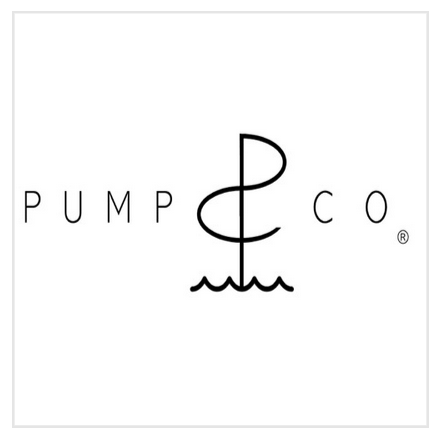

Eron's father (David Smith) is a mechancal engineering professor at Georgia Tech. For one of the "design problem," students need to build a product for a company. To hook the students, David asked us to write **jingles** and **commercials**. 

One of most iconic companies is "Pump Co."—a company to sell water pumps (Eron even made a logo...). David ordered customized pens with the logo, and he's still getting promotional emails to "help grow his company." I've attached an example commercial + jingle below.

 <a href = "https://soundcloud.com/matthew-chiu/pumpco-commercial?si=749e043551674046b4d03e446e0758f0&utm_source=clipboard&utm_medium=text&utm_campaign=social_sharing">Pump Co. commercial</a> and <a href = "https://soundcloud.com/matthew-chiu/pumpcojingleaudio?si=fbc0102be5424351a354c83658b3ba35&utm_source=clipboard&utm_medium=text&utm_campaign=social_sharing">Pump Co. Jingle</a> 

