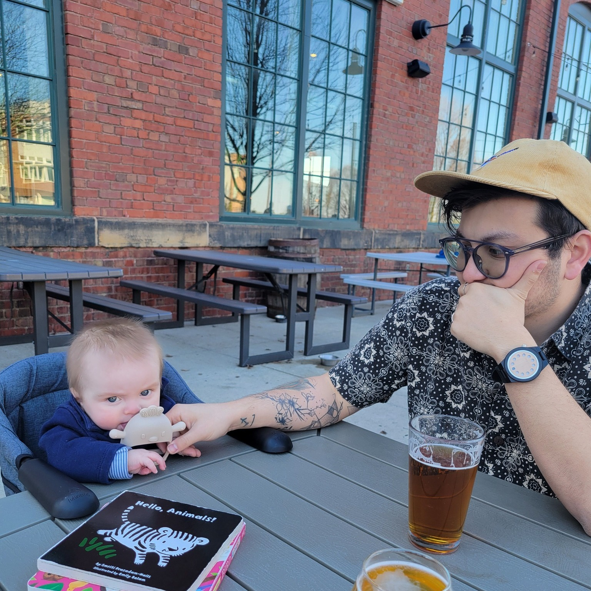

```python
class Matt:
	def __init__(self, job, location):
		self.job = 'Assistant Prof., Music Theory'
		self.location = 'Baldwin Wallace University' # Cleveland
```

## Want to read about my research?
My research primarily concerns computational methods—I draw on methods from #artificialIntelligence (expert systems and #machineLearning) for music analysis. Recurring techniques I use involve #embeddings (see [[Scalar and Macroharmonic Embeddings]]) and the #fourierTransform (see [[Durufle Macroharmony]]), and #probability (see [[Step Inertia in Pop]]). The most interesting results are when my models misalign with my musical intuition; in my research, I continue to interrogate that misalignment, whether that's a bias of the model or a subjective priority of my own. See more here: [Research](Research/index.md).

## Datasets
Folks using computational models need data! I've been involved in a few projects building "corpora" (a fancy term for dataset (pl.)), [[Emo Fretboard Dataset|encoding emo guitar riffs]], [[Koji Kondo Corpus|tagging video game music]], [[Common-Practice Cadence Corpus|labeling cadences in common-practice music]], and others. To read more or access the datasets, read here: [Datasets](Datasets/index.md)

## A few oddities
If you go to [Odd Links](Odd%20Links/index.md), you'll find more of my personality. The folder contains an interactive [[Bird Map]], [[Fruit Preferences|multidimensional scaling of fruit preferences]] with Eron's family, [[GT Jingles|jingles]], and other nonsense one-day projects. (It also contains the annual [[M&E Missives|missive]] I write with Eron.)

## Teaching/Education
Prior to #BaldwinWallace, I taught at #UniversityOfIllinois, #Union College, the #Eastman School of Music (Ph.D), and #BostonUniversity (MM). See [Teaching](Teaching/index.md) for more information on classes I've taught.

## Other
In my free time I like to take photos, bird watch, make faces at the baby (Cedar), and play piano with my 4-hands partner (and partner) Eron.

<center></center>

---
## Contact me 
`mchiu @ bw.edu`
